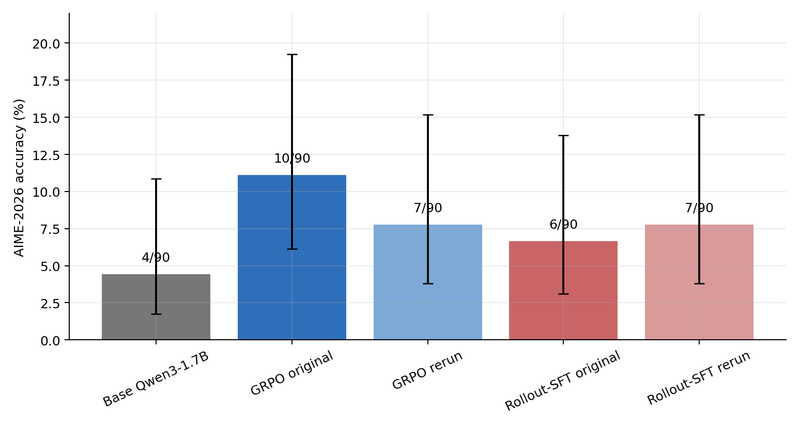
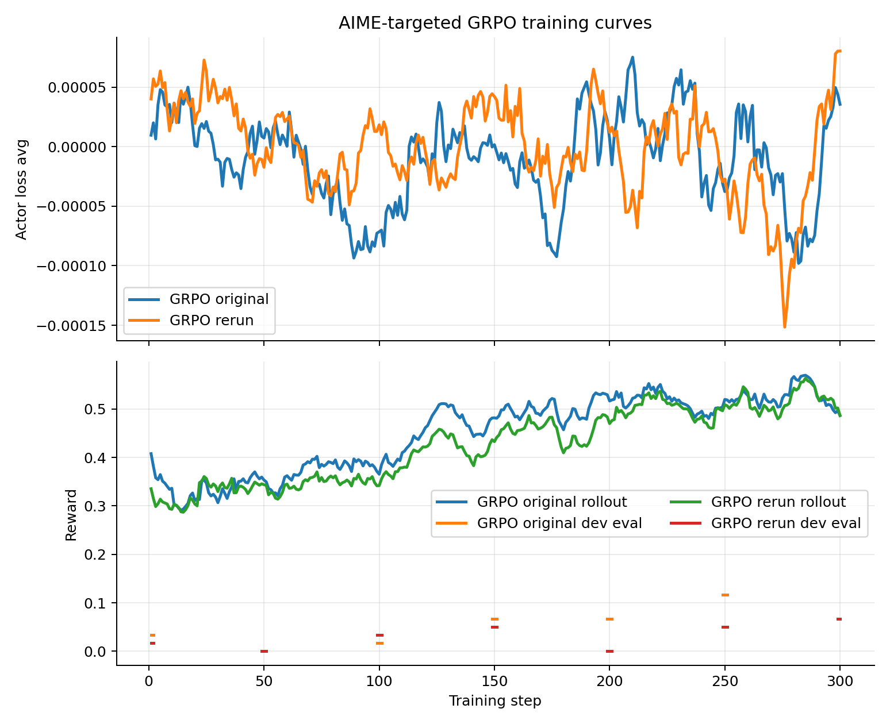
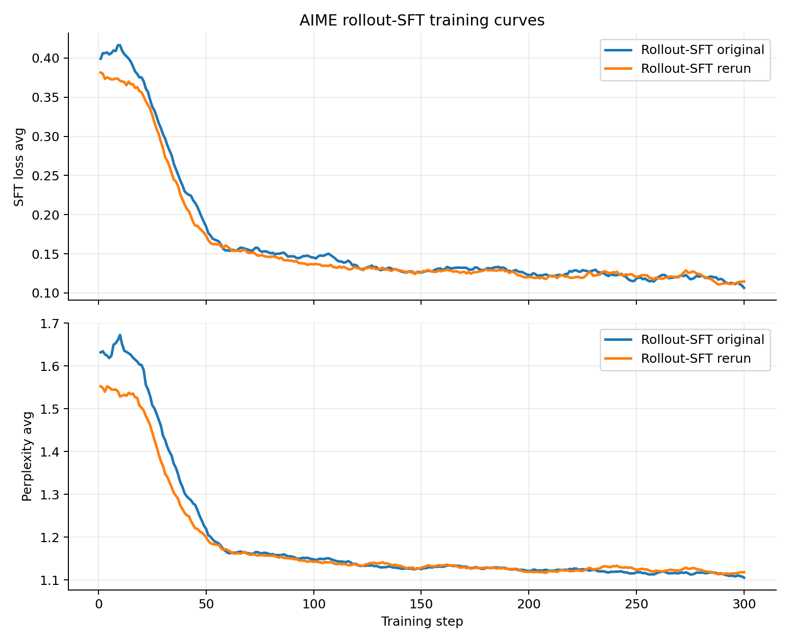
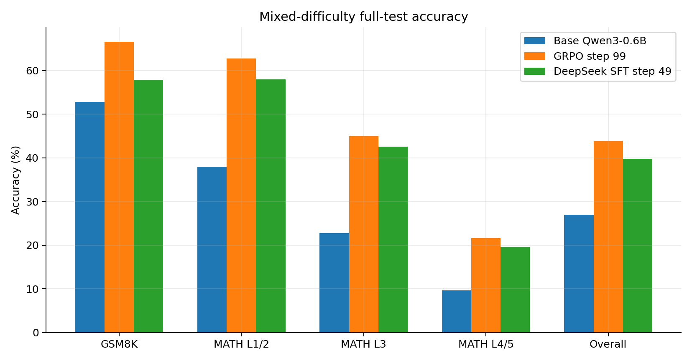
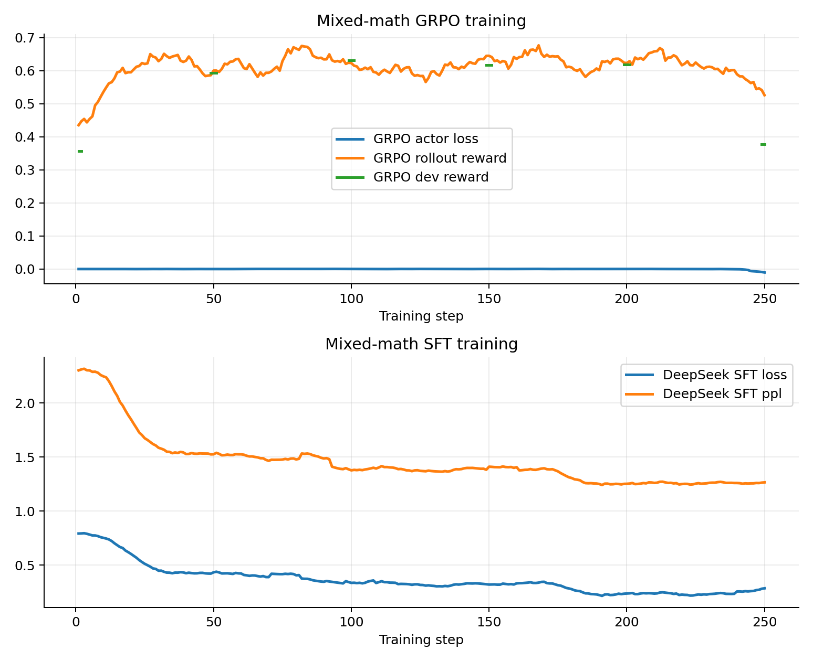

# Progress Report: AReaL Megatron/SGLang Math RLVR Baselines

Date: 2026-04-29  
Workspace: `/NHNHOME/PROJECT/wbl-workspace/ewer/rl-test`  
Runtime artifacts: `/NHNHOME/areal_runs/qwen3-gsm8k-rlvr`

## Summary

This report documents the final short-run math recipes developed in this
workspace. The primary target is MathArena AIME-2026, with a supporting
mixed-difficulty benchmark over held-out GSM8K and MATH test splits.

The final AIME-2026 result uses `Qwen/Qwen3-1.7B`. `Qwen/Qwen3-0.6B` scored
0/30 in initial AIME-2026 checks at the tested budgets, so the targeted AIME
recipe moved to the 1.7B model. The final GRPO recipe uses AReaL with a Megatron
actor and SGLang rollouts on a 2+2 B200 split. The final supervised recipe is
rollout-SFT/RFT: Megatron SFT on verifier-correct completions produced by the
same clean GRPO prompt distribution.

Reviewer verdict: these runs are acceptable as technical baselines and as a
foundation for further research. They should not be described as a sealed
benchmark result because AIME-2026 was used during recipe iteration. A paper
should either freeze these recipes and evaluate on a later unseen benchmark, or
explicitly label the AIME-2026 numbers as development-informed.

## Acceptance Criteria

| Requirement | Status | Evidence |
| --- | --- | --- |
| Use AReaL with Megatron and SGLang | Met for GRPO | Actor backend `megatron:d2p1t1`, rollout backend `sglang:d2p1t1` in `AReaL/rlvr_demo/configs/qwen3_17b_aime_hardmath_correct_grpo_b200_dev_300.yaml`. |
| Improve Qwen3 on AIME-2026 | Met | Base `Qwen3-1.7B`: 4/90. GRPO: 10/90 original and 7/90 rerun. Rollout-SFT: 6/90 original and 7/90 rerun. |
| Optimize for this node | Met | Recipes use 4x B200 with no offload, 2 actor GPUs plus 2 rollout GPUs for GRPO, all 4 GPUs for SFT, tuned SGLang concurrency and memory fraction. |
| Split hygiene | Met for known sources | Exact overlap is 0; fuzzy matches >= 0.90 are 0 for AIME-2026 audits. Mixed official train/test exact overlap is removed before training. |
| Reproducibility | Met | Original runs and post-commit reruns are both positive; report assets are generated from logged artifacts by `progress-report/scripts/generate_assets.py`. |

## Hardware And Runtime

The node has four NVIDIA B200 GPUs:

| GPU | Memory | Driver |
| --- | ---: | --- |
| NVIDIA B200 x4 | 183,359 MiB each | 580.95.05 |

Common runtime settings:

| Setting | Value |
| --- | --- |
| `HF_HOME` | `/NHNHOME/areal_cache/huggingface` |
| `TRITON_CACHE_DIR` | `/NHNHOME/areal_cache/triton` |
| `NCCL_SOCKET_IFNAME` / `GLOO_SOCKET_IFNAME` | `eth0` |
| `NCCL_CUMEM_ENABLE` / `NCCL_NVLS_ENABLE` | `0` |
| `CUDA_DEVICE_MAX_CONNECTIONS` | `1` |
| `PYTORCH_CUDA_ALLOC_CONF` | `expandable_segments:True` |

Measured training times from logs:

| Run | Steps | First step sec | Last step sec | Primary training signal |
| --- | ---: | ---: | ---: | --- |
| AIME GRPO original | 300 | 5.121 | 2.290 | Rollout reward 0.3177 -> 0.6410 |
| AIME GRPO rerun | 300 | 4.774 | 2.476 | Rollout reward 0.3047 -> 0.6168 |
| AIME rollout-SFT original | 300 | 2.237 | 0.143 | SFT loss 0.3394 -> 0.1206 |
| AIME rollout-SFT rerun | 300 | 2.214 | 0.143 | SFT loss 0.3615 -> 0.1010 |
| Mixed GRPO | 250 | 5.083 | 3.307 | Rollout reward 0.3750 -> 0.5078 |
| Mixed DeepSeek SFT | 250 | 2.109 | 0.116 | SFT loss 0.7710 -> 0.2726 |

Raw parsed metrics are in [`tables/training_log_summary.csv`](tables/training_log_summary.csv).

## Data

### AIME-2026 Targeted Training

Evaluation benchmark:

- `MathArena/aime_2026`; 30 problems.
- Final evaluation uses three stochastic seeds: 7, 13, and 21.
- This benchmark is never loaded by training configs.

GRPO training prompts:

| Source | Split / years | Use |
| --- | --- | --- |
| `lchen001/AIME1983_2024` | 1983-2021 | Historical AIME training prompts |
| `allenai/aime-2022-2025` | 2022-2023 | Recent AIME training prompts |
| `DigitalLearningGmbH/MATH-lighteval` | train, Levels 3-5 | Harder non-AIME math prompts |

Development holdouts used during AIME recipe work:

| Source | Use |
| --- | --- |
| AIME 2024 | Development/eval holdout |
| AIME 2025 | Development/eval holdout |

Supervised AIME data:

- The final SFT data is not DeepSeek teacher data.
- It is RFT-style supervised distillation from verifier-correct GRPO rollouts.
- Original JSONL: 5,577 rows over 2,932 unique prompts.
- Repro JSONL: 5,326 rows over 2,815 unique prompts.
- Extraction uses at most two correct completions per prompt and fails if a
  selected prompt is outside the allowed pre-2026 training source preset.

### Mixed-Difficulty Training

The supporting mixed-difficulty baseline uses `Qwen/Qwen3-0.6B`.

Training sources:

| Source | Split | Use |
| --- | --- | --- |
| `openai/gsm8k` | train | Grade-school arithmetic and word problems |
| `DigitalLearningGmbH/MATH-lighteval` | train | MATH Levels 1-5 |

Official test sources:

| Source | Split | Test bucket |
| --- | --- | --- |
| `openai/gsm8k` | test | GSM8K |
| `DigitalLearningGmbH/MATH-lighteval` | test | MATH L1/2, L3, L4/5 |

Clean split counts:

| Split | GSM8K | MATH L1/2 | MATH L3 | MATH L4/5 | Other |
| --- | ---: | ---: | ---: | ---: | ---: |
| Clean train pool | 7,473 | 1,912 | 1,592 | 3,992 | 2 |
| Shared validation holdout | 128 | 64 | 64 | 64 | 0 |
| GRPO train | 7,345 | 1,848 | 1,528 | 3,928 | 2 |
| DeepSeek SFT train | 913 | 725 | 670 | 697 | 0 |
| DeepSeek SFT validation | 32 | 32 | 32 | 32 | 0 |
| Official test | 1,319 | 1,331 | 1,131 | 2,538 | 0 |

The mixed DeepSeek SFT generator reads the API key from
`/NHNHOME/PROJECT/wbl-workspace/ewer/rl-test/.env`, uses `deepseek-v4-pro` with
high reasoning, and supports 128-way concurrency. The generated JSONL is ignored
by git.

## Split Hygiene

AIME audit command:

```bash
cd /NHNHOME/PROJECT/wbl-workspace/ewer/rl-test/AReaL
.venv/bin/python -m rlvr_demo.audit_aime2026_splits --fail-on-overlap
```

AIME audit summary, fuzzy threshold 0.90:

| Check | Unique train prompts | Exact overlap with AIME-2026 | Max fuzzy ratio | Fuzzy pairs >= 0.90 |
| --- | ---: | ---: | ---: | ---: |
| GRPO train prompts | 6,442 | 0 | 0.668810 | 0 |
| RFT-SFT prompts, original | 2,932 | 0 | 0.668810 | 0 |
| RFT-SFT prompts, rerun | 2,815 | 0 | 0.668810 | 0 |

Additional AIME checks:

| Check | Result |
| --- | ---: |
| RFT-SFT prompts not present in GRPO train prompts, original | 0 |
| RFT-SFT prompts not present in GRPO train prompts, rerun | 0 |
| GRPO train vs AIME-2024 exact overlap | 0 |
| RFT-SFT prompts vs AIME-2024 exact overlap | 0 |
| GRPO train vs AIME-2025 exact overlap | 0 |
| RFT-SFT prompts vs AIME-2025 exact overlap | 0 |
| Strict extractor skipped disallowed reward-passing prompts, rerun | 0 |

Mixed audit command:

```bash
cd /NHNHOME/PROJECT/wbl-workspace/ewer/rl-test/AReaL
.venv/bin/python -m rlvr_demo.audit_multi_math_splits \
  --deepseek-jsonl rlvr_demo/data/deepseek_v4_pro_multi_math_balanced_sft.jsonl \
  --fail-on-overlap
```

Mixed audit summary:

| Check | Overlap |
| --- | ---: |
| GRPO train vs shared validation | 0 |
| GRPO train vs official test | 0 |
| Shared validation vs official test | 0 |
| DeepSeek SFT train vs shared validation | 0 |
| DeepSeek SFT train vs official test | 0 |
| DeepSeek SFT validation vs shared validation | 0 |
| DeepSeek SFT validation vs official test | 0 |

One raw GSM8K/MATH train example exactly overlapped an official test example and
was removed before forming the final clean training pool.

## Final Recipes

### AIME GRPO

Config:
`AReaL/rlvr_demo/configs/qwen3_17b_aime_hardmath_correct_grpo_b200_dev_300.yaml`

Run:

```bash
cd /NHNHOME/PROJECT/wbl-workspace/ewer/rl-test/AReaL
bash rlvr_demo/scripts/run_multi_math_grpo_b200.sh \
  rlvr_demo/configs/qwen3_17b_aime_hardmath_correct_grpo_b200_dev_300.yaml \
  experiment_name=qwen3-17b-aime-hardmath-correct-grpo-b200-dev-300-r1
```

Important hyperparameters:

| Setting | Value |
| --- | --- |
| Model | `Qwen/Qwen3-1.7B` |
| Actor backend | `megatron:d2p1t1` |
| Rollout backend | `sglang:d2p1t1` |
| GPU topology | 2 Megatron actor GPUs + 2 SGLang rollout GPUs |
| Steps | 300 |
| Train batch | 16 prompts |
| Samples per prompt | 8 |
| Max prompt length | 2,048 |
| Max new tokens, train | 1,024 |
| Sampling | temperature 0.6, top_p 0.95, top_k 20 |
| Reward | correctness only |
| Actor LR | 1e-6 constant |
| Adam betas | 0.9, 0.999 |
| Weight decay | 0.01 |
| PPO clip | 0.25 |
| KL coefficient | 0.0 |
| Reward norm | group mean/std, group size 8 |
| Advantage norm | batch mean/std |
| Rejection sampling | ratio upper 5.0 |
| SGLang max running requests | 128 |
| SGLang context length | 4,096 |
| SGLang static memory fraction | 0.60 |
| SGLang attention backend | flashinfer |

Selected checkpoint:

```text
/NHNHOME/areal_runs/qwen3-gsm8k-rlvr/checkpoints/ewer/qwen3-17b-aime-hardmath-correct-grpo-b200-dev-300-r1/trial0/default/epoch0epochstep299globalstep299
```

Repro checkpoint:

```text
/NHNHOME/areal_runs/qwen3-gsm8k-rlvr/checkpoints/ewer/qwen3-17b-aime-hardmath-correct-grpo-b200-dev-300-repro1/trial0/default/epoch0epochstep299globalstep299
```

### AIME Rollout-SFT

Generate supervised rows from GRPO rollouts:

```bash
cd /NHNHOME/PROJECT/wbl-workspace/ewer/rl-test/AReaL
.venv/bin/python -m rlvr_demo.extract_rollout_rft_sft \
  --rollout-dir /NHNHOME/areal_runs/qwen3-gsm8k-rlvr/logs/ewer/qwen3-17b-aime-hardmath-correct-grpo-b200-dev-300-r1/trial0/rollout \
  --output rlvr_demo/data/qwen3_17b_hardmath_grpo_correct_rollout_sft_max2.jsonl \
  --max-per-question 2 \
  --seed 7 \
  --allowed-source-preset aime_hardmath_pre2024 \
  --fail-on-disallowed
```

Train:

```bash
cd /NHNHOME/PROJECT/wbl-workspace/ewer/rl-test/AReaL
bash rlvr_demo/scripts/run_multi_math_deepseek_sft_b200.sh \
  rlvr_demo/configs/qwen3_17b_aime_rollout_rft_sft_b200_300.yaml \
  experiment_name=qwen3-17b-aime-rollout-rft-sft-b200-300-r1
```

Important hyperparameters:

| Setting | Value |
| --- | --- |
| Model | `Qwen/Qwen3-1.7B` |
| Backend | `megatron:d4p1t1` |
| GPU topology | all 4 B200 GPUs |
| Steps | 300 |
| Train batch | 16 examples |
| Max total length | 4,096 |
| LR | 5e-7 |
| LR schedule | cosine |
| Warmup | 5% |
| Adam betas | 0.9, 0.95 |
| Weight decay | 0.01 |
| Gradient clip | 1.0 |
| Checkpoint cadence | 50 steps |

Selected checkpoint:

```text
/NHNHOME/areal_runs/qwen3-gsm8k-rlvr/checkpoints/ewer/qwen3-17b-aime-rollout-rft-sft-b200-300-r1/trial0/default/epoch1epochstep16globalstep199
```

Repro checkpoint:

```text
/NHNHOME/areal_runs/qwen3-gsm8k-rlvr/checkpoints/ewer/qwen3-17b-aime-rollout-rft-sft-b200-300-repro1/trial0/default/epoch1epochstep16globalstep199
```

### Mixed-Difficulty GRPO

Config:
`AReaL/rlvr_demo/configs/qwen3_06b_multi_math_grpo_b200_250.yaml`

Run:

```bash
cd /NHNHOME/PROJECT/wbl-workspace/ewer/rl-test/AReaL
bash rlvr_demo/scripts/run_multi_math_grpo_b200.sh \
  rlvr_demo/configs/qwen3_06b_multi_math_grpo_b200_250.yaml \
  experiment_name=qwen3-06b-multi-math-grpo-b200-250-reviewed-v2
```

Important hyperparameters:

| Setting | Value |
| --- | --- |
| Model | `Qwen/Qwen3-0.6B` |
| Actor backend | `megatron:d2p1t1` |
| Rollout backend | `sglang:d2p1t1` |
| GPU topology | 2 Megatron actor GPUs + 2 SGLang rollout GPUs |
| Steps | 250 |
| Train batch | 32 prompts |
| Samples per prompt | 8 |
| Max prompt length | 1,536 |
| Max new tokens | 512 |
| Sampling | temperature 0.6, top_p 0.95, top_k 20 |
| Reward | correctness + 0.1 strict format |
| Actor LR | 5e-6 constant |
| PPO clip | 0.4 |
| KL coefficient | 0.0 |
| SGLang context length | 3,072 |
| SGLang max running requests | 192 |
| SGLang static memory fraction | 0.60 |

### Mixed-Difficulty DeepSeek SFT

Generate teacher data:

```bash
cd /NHNHOME/PROJECT/wbl-workspace/ewer/rl-test/AReaL
bash rlvr_demo/scripts/generate_multi_math_deepseek_sft.sh
```

Train:

```bash
cd /NHNHOME/PROJECT/wbl-workspace/ewer/rl-test/AReaL
bash rlvr_demo/scripts/run_multi_math_deepseek_sft_b200.sh \
  rlvr_demo/configs/qwen3_06b_multi_math_deepseek_sft_b200_250.yaml \
  experiment_name=qwen3-06b-multi-math-deepseek-sft-b200-250-reviewed-v2
```

Important hyperparameters:

| Setting | Value |
| --- | --- |
| Model | `Qwen/Qwen3-0.6B` |
| Backend | `megatron:d4p1t1` |
| GPU topology | all 4 B200 GPUs |
| Steps | 250 |
| Train batch | 32 examples |
| Max total length | 4,096 |
| LR | 6e-6 |
| LR schedule | cosine |
| Warmup | 3% |
| Adam betas | 0.9, 0.95 |
| Weight decay | 0.01 |
| Gradient clip | 1.0 |

## Evaluation Protocol

AIME-2026 generated-answer evaluation:

```bash
cd /NHNHOME/PROJECT/wbl-workspace/ewer/rl-test/AReaL
CUDA_VISIBLE_DEVICES=0 bash rlvr_demo/scripts/eval_multi_math_hf.sh \
  <MODEL_OR_CHECKPOINT> \
  rlvr_demo/results/<OUTPUT_DIR> \
  0 8 \
  --benchmarks aime_2026 \
  --seed <7|13|21> \
  --max-new-tokens 1536 \
  --max-prompt-length 2048 \
  --write-predictions
```

Mixed full-test evaluation:

```bash
cd /NHNHOME/PROJECT/wbl-workspace/ewer/rl-test/AReaL
CUDA_VISIBLE_DEVICES=0 bash rlvr_demo/scripts/eval_multi_math_hf.sh \
  <MODEL_OR_CHECKPOINT> \
  rlvr_demo/results/<OUTPUT_DIR> \
  0 128
```

All final reported numbers are generated-answer exact-match scores after answer
extraction and `math_verify` checking. The AIME table reports three stochastic
seeds. The mixed table reports one full test pass with seed 7.

## Main Result: AIME-2026



Per-seed AIME-2026 results:

| Model / checkpoint | Seed 7 | Seed 13 | Seed 21 | Total |
| --- | ---: | ---: | ---: | ---: |
| Base `Qwen/Qwen3-1.7B` | 2/30 | 2/30 | 0/30 | 4/90 = 4.44% |
| GRPO original, step 299 | 3/30 | 3/30 | 4/30 | 10/90 = 11.11% |
| GRPO rerun, step 299 | 3/30 | 2/30 | 2/30 | 7/90 = 7.78% |
| Rollout-SFT original, step 199 | 2/30 | 2/30 | 2/30 | 6/90 = 6.67% |
| Rollout-SFT rerun, step 199 | 2/30 | 3/30 | 2/30 | 7/90 = 7.78% |

Aggregate AIME-2026 score with Wilson 95% intervals:

| Model / checkpoint | Correct | Accuracy | Wilson 95% CI |
| --- | ---: | ---: | --- |
| Base `Qwen/Qwen3-1.7B` | 4/90 | 4.44% | 1.74% to 10.88% |
| GRPO original, step 299 | 10/90 | 11.11% | 6.15% to 19.26% |
| GRPO rerun, step 299 | 7/90 | 7.78% | 3.82% to 15.19% |
| Rollout-SFT original, step 199 | 6/90 | 6.67% | 3.09% to 13.79% |
| Rollout-SFT rerun, step 199 | 7/90 | 7.78% | 3.82% to 15.19% |

Paired comparison against the same base generations:

| Candidate | Candidate-only correct | Base-only correct | Both correct | Both wrong | Sign-test p |
| --- | ---: | ---: | ---: | ---: | ---: |
| GRPO original | 6 | 0 | 4 | 80 | 0.0312 |
| GRPO rerun | 4 | 1 | 3 | 82 | 0.3750 |
| Rollout-SFT original | 3 | 1 | 3 | 83 | 0.6250 |
| Rollout-SFT rerun | 3 | 0 | 4 | 83 | 0.2500 |

The original GRPO run is the strongest AIME result and passes a paired sign test
against base at p = 0.0312. The reruns are positive but the 30-problem benchmark
leads to wide uncertainty, so the correct interpretation is "consistent
improvement signal" rather than a precise effect-size estimate.

## Training Curves

AIME GRPO:



AIME rollout-SFT:



The GRPO runs increase rollout reward over 300 steps in both the original run
and the rerun. The AIME rollout-SFT runs show smooth supervised loss and
perplexity reduction; checkpoint selection is still based on downstream
AIME-2026 generated-answer accuracy rather than final training loss.

## Supporting Result: Mixed-Difficulty Math

The mixed benchmark is not the primary target, but it is the strongest evidence
that the recipes transfer across easy and hard math slices.



Full official-test generated-answer results:

| Model / checkpoint | GSM8K | MATH L1/2 | MATH L3 | MATH L4/5 | Overall |
| --- | ---: | ---: | ---: | ---: | ---: |
| Base `Qwen/Qwen3-0.6B` | 696/1319 = 52.77% | 506/1331 = 38.02% | 257/1131 = 22.72% | 244/2538 = 9.61% | 1703/6319 = 26.95% |
| GRPO step 99 | 879/1319 = 66.64% | 835/1331 = 62.73% | 508/1131 = 44.92% | 547/2538 = 21.55% | 2769/6319 = 43.82% |
| DeepSeek SFT step 49 | 763/1319 = 57.85% | 772/1331 = 58.00% | 481/1131 = 42.53% | 496/2538 = 19.54% | 2512/6319 = 39.75% |

Full-test format and reward diagnostics:

| Model / checkpoint | Overall format rate | Overall mean reward |
| --- | ---: | ---: |
| Base `Qwen/Qwen3-0.6B` | 10.56% | 0.2801 |
| GRPO step 99 | 96.77% | 0.5350 |
| DeepSeek SFT step 49 | 82.32% | 0.4799 |

Mixed training curves:



The mixed run shows a large overall improvement for both methods. GRPO is the
stronger of the two on every bucket. DeepSeek SFT is still a useful supervised
baseline because it improves all buckets while training in under two minutes
after initialization.

## Reproduction Checklist

From a clean checkout of this workspace:

1. Ensure runtime caches and `.env` are available:

```bash
cd /NHNHOME/PROJECT/wbl-workspace/ewer/rl-test
test -f .env
test -d AReaL/.venv
```

2. Run the AIME split audit:

```bash
cd /NHNHOME/PROJECT/wbl-workspace/ewer/rl-test/AReaL
.venv/bin/python -m rlvr_demo.audit_aime2026_splits --fail-on-overlap
```

3. Train AIME GRPO:

```bash
bash rlvr_demo/scripts/run_multi_math_grpo_b200.sh \
  rlvr_demo/configs/qwen3_17b_aime_hardmath_correct_grpo_b200_dev_300.yaml \
  experiment_name=qwen3-17b-aime-hardmath-correct-grpo-b200-dev-300-repro1
```

4. Extract rollout-SFT data from the GRPO rollouts:

```bash
.venv/bin/python -m rlvr_demo.extract_rollout_rft_sft \
  --rollout-dir /NHNHOME/areal_runs/qwen3-gsm8k-rlvr/logs/ewer/qwen3-17b-aime-hardmath-correct-grpo-b200-dev-300-repro1/trial0/rollout \
  --output rlvr_demo/data/qwen3_17b_hardmath_grpo_correct_rollout_sft_repro1_max2.jsonl \
  --max-per-question 2 \
  --seed 7 \
  --allowed-source-preset aime_hardmath_pre2024 \
  --fail-on-disallowed
```

5. Train AIME rollout-SFT:

```bash
bash rlvr_demo/scripts/run_multi_math_deepseek_sft_b200.sh \
  rlvr_demo/configs/qwen3_17b_aime_rollout_rft_sft_b200_300.yaml \
  experiment_name=qwen3-17b-aime-rollout-rft-sft-b200-300-repro1
```

6. Evaluate AIME-2026 with seeds 7, 13, and 21:

```bash
CUDA_VISIBLE_DEVICES=0 bash rlvr_demo/scripts/eval_multi_math_hf.sh \
  <MODEL_OR_CHECKPOINT> \
  rlvr_demo/results/<OUTPUT_DIR> \
  0 8 \
  --benchmarks aime_2026 \
  --seed 7 \
  --max-new-tokens 1536 \
  --max-prompt-length 2048 \
  --write-predictions
```

Repeat the evaluation command with `--seed 13` and `--seed 21`.

7. Regenerate this report's tables and figures:

```bash
cd /NHNHOME/PROJECT/wbl-workspace/ewer/rl-test
AReaL/.venv/bin/python progress-report/scripts/generate_assets.py
```

## Report Artifacts

Generated figures:

| Figure | File |
| --- | --- |
| AIME aggregate accuracy | [`figures/aime2026_aggregate_accuracy.png`](figures/aime2026_aggregate_accuracy.png) |
| AIME GRPO curves | [`figures/aime_grpo_training_curves.png`](figures/aime_grpo_training_curves.png) |
| AIME rollout-SFT curves | [`figures/aime_sft_training_curves.png`](figures/aime_sft_training_curves.png) |
| Mixed full-test accuracy | [`figures/mixed_math_accuracy.png`](figures/mixed_math_accuracy.png) |
| Mixed training curves | [`figures/mixed_math_training_curves.png`](figures/mixed_math_training_curves.png) |

Generated tables:

| Table | File |
| --- | --- |
| AIME per-seed results | [`tables/aime2026_seed_results.csv`](tables/aime2026_seed_results.csv) |
| AIME aggregate results | [`tables/aime2026_aggregate_results.csv`](tables/aime2026_aggregate_results.csv) |
| AIME paired tests | [`tables/aime2026_paired_tests.csv`](tables/aime2026_paired_tests.csv) |
| Mixed test results | [`tables/mixed_math_test_results.csv`](tables/mixed_math_test_results.csv) |
| Training log summary | [`tables/training_log_summary.csv`](tables/training_log_summary.csv) |

Generation script:

```text
progress-report/scripts/generate_assets.py
```

The script reads immutable logs and evaluation outputs from the runtime
directories and writes only small report artifacts under `progress-report/`.

## Limitations

- AIME-2026 was used during recipe iteration. The score is clean with respect to
  train/test overlap, but not sealed with respect to research feedback.
- AIME-2026 has only 30 problems. Three decoding seeds help, but confidence
  intervals remain wide.
- The AIME supervised recipe is rollout-SFT/RFT, not independent teacher SFT.
- The mixed-difficulty result uses one training seed. Before using it as a paper
  baseline, add at least two more training seeds or freeze it as an engineering
  baseline rather than a statistical claim.
- The contamination audits cover exact normalized questions and fuzzy text
  matches for known local sources. They cannot prove absence of pretraining
  contamination in the base Qwen models.

## References

- AReaL: https://github.com/inclusionAI/AReaL
- AReaL documentation: https://inclusionai.github.io/AReaL/
- AReaL GRPO with SGLang guide: https://inclusionai.github.io/AReaL/lite/gsm8k_grpo.html
- Qwen3-1.7B: https://huggingface.co/Qwen/Qwen3-1.7B
- Qwen3-0.6B: https://huggingface.co/Qwen/Qwen3-0.6B
- MathArena AIME-2026: https://huggingface.co/datasets/MathArena/aime_2026
- Historical AIME dataset: https://huggingface.co/datasets/lchen001/AIME1983_2024
- GSM8K: https://arxiv.org/abs/2110.14168
- MATH: https://arxiv.org/abs/2103.03874
- DeepSeekMath / GRPO reference: https://arxiv.org/abs/2402.03300
