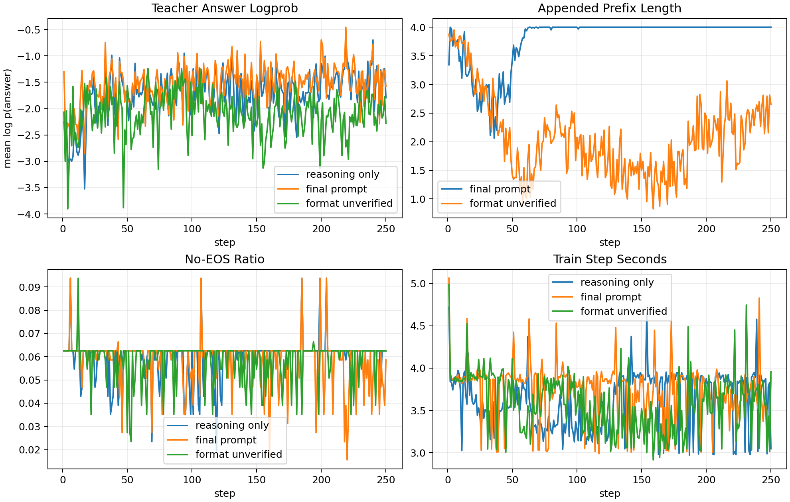
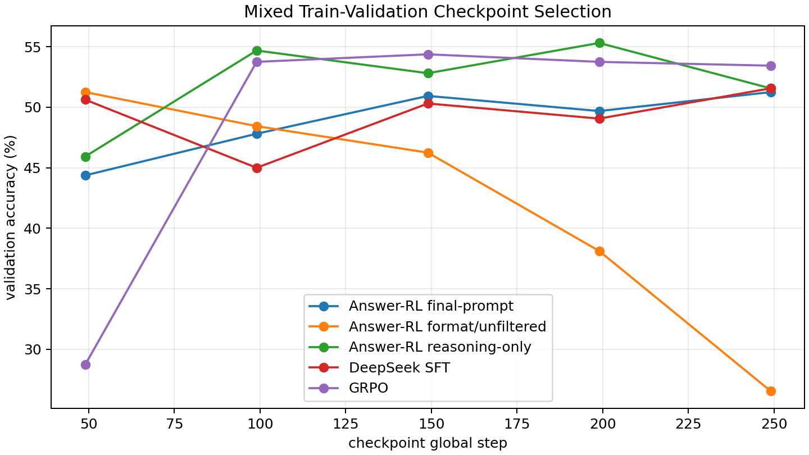
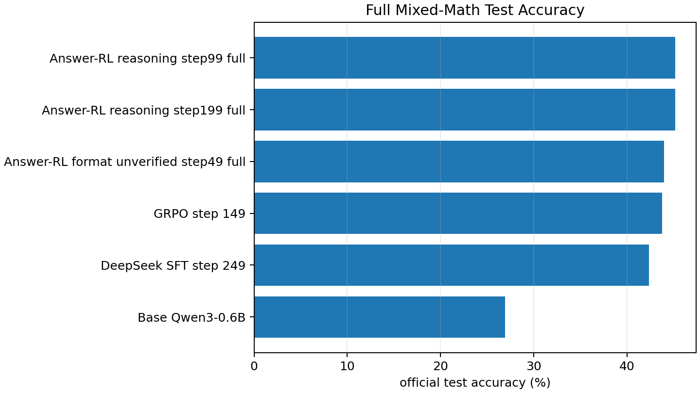

# Teacher-Answer RL For Math Reasoning

This report documents a verifier-free RL/distillation experiment for
`Qwen/Qwen3-0.6B` on the mixed GSM8K/MATH benchmark suite.  The goal was to test
a GRPO-like algorithm that uses only a strong teacher's final answer text, not a
gold-answer verifier and not teacher reasoning.

All runs used AReaL on this 4x B200 node.  RL runs used the Megatron actor
backend with SGLang rollouts.

## Result Summary

The final verifier-free recipe is **format-regularized teacher-answer
likelihood RL**, selected at global step 49.  It trains from unfiltered
DeepSeek-V4-Pro teacher answers (`require_correct=false`), so the reward does
not use gold correctness labels.

| Method | Train reward uses verifier? | Teacher reasoning used? | Official test correct | Accuracy | Strict format |
| --- | --- | --- | ---: | ---: | ---: |
| Base `Qwen3-0.6B` | no training | no | 1703/6319 | 26.95% | 10.56% |
| DeepSeek SFT step 249 | yes, data filtered | yes | 2677/6319 | 42.36% | 79.78% |
| GRPO step 149 | yes | no | 2767/6319 | 43.79% | 96.04% |
| **Answer-RL format/unfiltered step 49** | **no** | **no** | **2778/6319** | **43.96%** | **60.41%** |
| Answer-RL reasoning-only step 99 | yes, data filtered | no | 2856/6319 | 45.20% | 37.81% |

The final recipe gives a +17.01 point absolute gain over base and slightly
beats the existing GRPO full-test baseline, but with lower strict-format rate.
The reasoning-only ablation is more accurate but is not the final recipe because
it used verified teacher-answer filtering and has weaker output-format
stability.

## Algorithm

For each question `q`, sample `K=8` student completions on policy.  Let `z_i` be
the generated reasoning/prefix span for sample `i`, and let `a` be the teacher's
final answer string.  The base reward is the student's own log-probability of
the teacher answer conditioned on the sampled student reasoning:

```text
r_i = mean_t log pi_theta(a_t | q, z_i, "Final answer:", a_<t)
```

The final recipe uses two verifier-free regularizers:

```text
r_i =
  mean_t log pi_theta(a_t | q, z_i, optional_prefix, a_<t)
  + beta * I[student generated "Final answer:"]
  - lambda * optimized_tokens / max_new_tokens
```

with `beta=1.0` and `lambda=0.2`.  Rewards are normalized within each GRPO group
and optimized with AReaL's PPO/GRPO actor update.  Teacher answer tokens are not
part of the rollout and are not directly supervised; they are used only in the
reward scoring pass.  The policy loss is applied to sampled student reasoning
and the generated answer prefix span.

This preserves the core constraint: training reward uses a teacher answer string
only.  It does not call `math_verify`, does not compare to gold answers, and
does not use teacher chain-of-thought.

## Implementation

Key files:

| File | Purpose |
| --- | --- |
| `AReaL/areal/trainer/rl_trainer.py` | Adds optional `rollout_postprocess_fn` hook after actor log-prob recomputation and before advantage computation. |
| `AReaL/rlvr_demo/teacher_answer_rl.py` | Implements answer-likelihood workflows, scoring batch construction, reward postprocess, format/length reward terms, and teacher-answer dataset loader. |
| `AReaL/rlvr_demo/train_qwen3_teacher_answer_rl.py` | Reasoning-only answer-RL entry point. |
| `AReaL/rlvr_demo/train_qwen3_teacher_answer_final_rl.py` | Eval-style prompt answer-RL entry point used by the final recipe. |
| `AReaL/rlvr_demo/scripts/run_teacher_answer_format_rl_b200.sh` | Final B200 runner. Sets reward regularizer environment variables. |
| `teacher-answer-rl-report/scripts/generate_assets.py` | Generates the tables and figures in this report. |

The trainer hook is intentionally minimal: existing AReaL GRPO behavior is
unchanged unless a postprocess callback is passed.

## Data And Split Hygiene

Evaluation uses the same official mixed test suite as the earlier baseline
work:

| Benchmark | Rows |
| --- | ---: |
| GSM8K test | 1,319 |
| MATH L1/2 test | 1,331 |
| MATH L3 test | 1,131 |
| MATH L4/5 test | 2,538 |
| Overall | 6,319 |

Training questions come from official train splits only.  Questions are
normalized by whitespace collapse and case folding, then hashed with SHA-256.
Any train question overlapping official test is removed.  The shared validation
holdout is also removed from teacher-answer training.

Audit command:

```bash
cd /NHNHOME/PROJECT/wbl-workspace/ewer/rl-test/AReaL
.venv/bin/python -m rlvr_demo.audit_multi_math_splits \
  --deepseek-jsonl rlvr_demo/data/deepseek_v4_pro_multi_math_balanced_sft.jsonl \
  --fail-on-overlap
```

The final audit includes both verified and unfiltered DeepSeek teacher-answer
splits.  Relevant unfiltered split counts:

| Split | Rows |
| --- | ---: |
| Unfiltered unique teacher-answer rows | 3,658 |
| After shared-validation filter | 3,571 |
| Final unfiltered train | 3,443 |
| Final unfiltered validation | 128 |
| Train vs validation overlap | 0 |
| Train vs official test overlap | 0 |
| Validation vs official test overlap | 0 |

Teacher answer quality metadata was present in the JSONL but not used by the
final recipe:

| Split | Correct teacher answer | Wrong teacher answer |
| --- | ---: | ---: |
| Unfiltered unique | 3,205 | 453 |
| Final train | 3,019 | 424 |
| Final validation | 114 | 14 |

## Final Recipe

Run from the AReaL directory:

```bash
cd /NHNHOME/PROJECT/wbl-workspace/ewer/rl-test/AReaL

TEACHER_ANSWER_FORMAT_BONUS=1.0 \
TEACHER_ANSWER_LENGTH_PENALTY=0.2 \
bash rlvr_demo/scripts/run_teacher_answer_format_rl_b200.sh \
  --config rlvr_demo/configs/qwen3_06b_multi_math_teacher_answer_final_rl_b200_250.yaml \
  experiment_name=qwen3-06b-multi-math-teacher-answer-format-unverified-b200-250-r1 \
  train_dataset.dataset_kwargs.require_correct=false \
  valid_dataset.dataset_kwargs.require_correct=false
```

Important settings:

| Setting | Value |
| --- | --- |
| Model | `Qwen/Qwen3-0.6B` |
| Actor backend | `megatron:d2p1t1` |
| Rollout backend | `sglang:d2p1t1` |
| GPU topology | 2 actor GPUs + 2 SGLang rollout GPUs |
| Steps | 250 |
| Batch | 32 prompts |
| Samples per prompt | 8 |
| Train max new tokens | 384 |
| Eval max new tokens | 512 |
| Sampling | `temperature=0.6`, `top_p=0.95`, `top_k=20` |
| LR | `3e-6`, constant |
| PPO clip | `0.25` |
| KL | `0.0` |
| Reward normalization | group mean/std, group size 8 |
| SGLang context | 3,072 |
| SGLang max running requests | 192 |
| SGLang static memory fraction | 0.60 |

The final run completed 250 steps in 1309.87 seconds after initialization.
Scheduled checkpoints were saved at global steps 49, 99, 149, 199, and 249.

## Reproduction Commands

Checkpoint selection:

```bash
CUDA_VISIBLE_DEVICES=0 bash rlvr_demo/scripts/eval_multi_math_validation_sweep.sh \
  qwen3-06b-multi-math-teacher-answer-format-unverified-b200-250-r1 \
  rlvr_demo/results/teacher_answer_format_unverified_r1_validation \
  0 128
```

Final full test:

```bash
CUDA_VISIBLE_DEVICES=0 bash rlvr_demo/scripts/eval_multi_math_hf.sh \
  /NHNHOME/areal_runs/qwen3-gsm8k-rlvr/checkpoints/ewer/qwen3-06b-multi-math-teacher-answer-format-unverified-b200-250-r1/trial0/default/epoch0epochstep49globalstep49 \
  rlvr_demo/results/teacher_answer_format_unverified_step49_full \
  0 128
```

Reasoning-only ablation full test:

```bash
CUDA_VISIBLE_DEVICES=1 bash rlvr_demo/scripts/eval_multi_math_hf.sh \
  /NHNHOME/areal_runs/qwen3-gsm8k-rlvr/checkpoints/ewer/qwen3-06b-multi-math-teacher-answer-rl-b200-250-r1/trial0/default/epoch1epochstep6globalstep99 \
  rlvr_demo/results/teacher_answer_reasoning_step99_full \
  0 128
```

Regenerate report assets:

```bash
cd /NHNHOME/PROJECT/wbl-workspace/ewer/rl-test
AReaL/.venv/bin/python teacher-answer-rl-report/scripts/generate_assets.py
```

## Validation Results

Checkpoint selection used the shared train-split validation holdout, not the
official test set.

| Method | Step | Correct | Accuracy | Strict format |
| --- | ---: | ---: | ---: | ---: |
| Answer-RL format/unfiltered | 49 | 164/320 | 51.25% | 70.00% |
| Answer-RL format/unfiltered | 99 | 155/320 | 48.44% | 60.94% |
| Answer-RL format/unfiltered | 149 | 148/320 | 46.25% | 74.38% |
| Answer-RL format/unfiltered | 199 | 122/320 | 38.12% | 50.00% |
| Answer-RL format/unfiltered | 249 | 85/320 | 26.56% | 34.69% |
| GRPO | 149 | 174/320 | 54.37% | 94.69% |
| DeepSeek SFT | 249 | 165/320 | 51.56% | 85.94% |
| Answer-RL reasoning-only | 99 | 175/320 | 54.69% | 47.81% |
| Answer-RL reasoning-only | 199 | 177/320 | 55.31% | 0.31% |

The final format/unfiltered recipe overtrains after step 49.  Early stopping on
the shared validation holdout is part of the recipe.

## Official Test Results

| Method | GSM8K | MATH L1/2 | MATH L3 | MATH L4/5 | Overall |
| --- | ---: | ---: | ---: | ---: | ---: |
| Base `Qwen3-0.6B` | 696/1319 | 506/1331 | 257/1131 | 244/2538 | 1703/6319 = 26.95% |
| DeepSeek SFT step 249 | 812/1319 | 802/1331 | 507/1131 | 556/2538 | 2677/6319 = 42.36% |
| GRPO step 149 | 893/1319 | 814/1331 | 502/1131 | 558/2538 | 2767/6319 = 43.79% |
| **Answer-RL format/unfiltered step 49** | **825/1319** | **833/1331** | **517/1131** | **603/2538** | **2778/6319 = 43.96%** |
| Answer-RL reasoning-only step 99 | 905/1319 | 829/1331 | 512/1131 | 610/2538 | 2856/6319 = 45.20% |
| Answer-RL reasoning-only step 199 | 870/1319 | 857/1331 | 544/1131 | 585/2538 | 2856/6319 = 45.20% |

Strict format rates:

| Method | Overall strict format |
| --- | ---: |
| Base `Qwen3-0.6B` | 10.56% |
| DeepSeek SFT step 249 | 79.78% |
| GRPO step 149 | 96.04% |
| **Answer-RL format/unfiltered step 49** | **60.41%** |
| Answer-RL reasoning-only step 99 | 37.81% |
| Answer-RL reasoning-only step 199 | 0.22% |

Full raw tables are in `tables/full_test_results.csv` and
`tables/validation_results.csv`.

## Figures







## Reviewer Assessment

I would accept this as a useful technical baseline with scoped claims:

- The final recipe demonstrates a real verifier-free training signal: it uses
  unfiltered teacher answer strings and improves Qwen3-0.6B on official math
  tests.
- The implementation is narrow and reproducible: AReaL/Megatron/SGLang are used
  end to end, and the trainer hook is opt-in.
- Split hygiene is now audited for the exact unfiltered data used by the final
  recipe.
- The result compares favorably to both prior GRPO and SFT baselines on
  accuracy, though not on strict formatting.

Limitations to carry forward:

- The final result is one training seed.  A paper should rerun at least three
  training seeds and report confidence intervals.
- The teacher-answer JSONL contains gold-verification metadata from data
  generation.  The final recipe does not use it, but a fully API-only dataset
  generation pass should omit correctness filtering entirely from the pipeline.
- The reward can overtrain.  Step 49 is best for the final recipe; later
  checkpoints lose validation accuracy.
- GRPO remains much stronger on strict output format.  If strict formatting is a
  hard product requirement, increase the format bonus or add a small supervised
  format anchor and revalidate.
